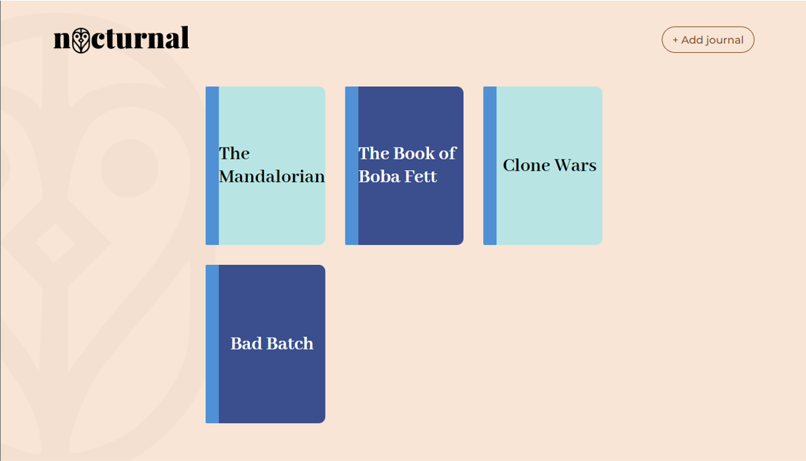

<h1 title="fuerza nocturnal" align="center">
  
</h1>

<p align="center">
  <a href="#pencil-objectives">Objectives</a>&nbsp;&nbsp;&nbsp;|&nbsp;&nbsp;&nbsp;
  <a href="#trophy-lessons-learned">Lessons Learned</a>&nbsp;&nbsp;&nbsp;|&nbsp;&nbsp;&nbsp;
  <a href="#rocket-technologies--resources">Technologies</a>&nbsp;&nbsp;&nbsp;|&nbsp;&nbsp;&nbsp;
  <a href="#hammer-setting-up-the-environment">Environment Setup</a>
</p>

<p align="center">
  

  

  

  
</p>

<p align="center">
  
</p>

This application was proposed by [Fuerza Studio](https://www.fuerzastudio.com.br/en/) as part of their recruitment process for frontend developers. The challenge was to build a fully responsive client application in React using TypeScript and consuming a fake REST API. The original statement cam be found [here](.github/statement.md).

[Check out the application running!](https://fuerza-nocturnal.vercel.app/)

## :pencil: Objectives

- [x] Build the UI based on [Figma's prototype](https://www.figma.com/file/NLTV0LaT4wTayhMusGZppT/Fuerza-Teste-(Copy)?node-id=0%3A1);
- [x] Use the fake *mirage* REST API (already set in the project) to simulate calls to a backend;
- [x] Implement a simple authentication system;
- [x] Make the UI responsive;

## :trophy: Lessons Learned

- Interaction with `mirage.js`*`;
- State management using `zustand`;
- Input label shrinking, similar to Material Design's;

## :rocket: Technologies & Resources

**Frontend:**
- [React 17](https://reactjs.org)
- [Zustand](https://zustand-demo.pmnd.rs/)
- [Axios](https://github.com/axios/axios) (HTTP client)

**Development:**
- [Visual Studio Code](https://code.visualstudio.com/)
- [Cmder](https://cmder.net/) (terminal emulator)
- [Node.js](https://nodejs.org/en/) scripts (with Laravel Mix)

## :hammer: Setting up the Environment

Make sure to have **Node.js 10+** installed in your machine and its **npm** available in the command line, then use the following command to install dependencies:

```bash
$ npm install
```

To execute the application, you must just configure a storage key for the authenticated user to be "maintained", although the fake backend is restarted on application refresh. The storage key is being pulled from environment variables, so create a `.env` file, at project root based on `.env.example`.

At last, you can use the following commands to run the application:

```bash
$ yarn start   # Run development server
$ yarn build   # Build files for production
```
